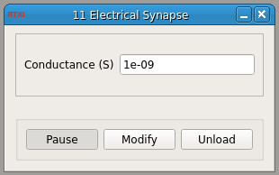

###Electric Synapse

**Requirements:** None  
**Limitations:**  None  

<!--start-->
Creates a simulated connection, or 'synapse,' between two cells. The module takes in voltage signals from two cells and outputs currents based on the voltage difference and user-specified conductance. 
<!--end-->

####Input Channels:
1. input(0) - Vm1 : Cellular voltage 1 (V)
2. input(1) - Vm2 : Cellular volatage 2 (V)

####Output Channels:
1. output(0) - Im1 : Current output of G\*(Vm2 - Vm1) (A)
2. output(1) - Im2 : Current output of G\*(Vm1 - Vm2) (A)

####Parameters:
1. Conductance (S) - conductance across the artificial synapse (S)
